# The Biscuiteers Biscuit Shop
[View the live project here.](https://biscuiteers-biscuit-shop.herokuapp.com/)

Biscuiteers is an e-commerce site offering hand iced artisan biscuit gifts.
Users are also benefit from a blog with comment functionality.
The site is fully responsive and was built using the Django framework in Python.
The payment system is called Stripe, it is set up in a 'dummy' mode and will not accept real card details.

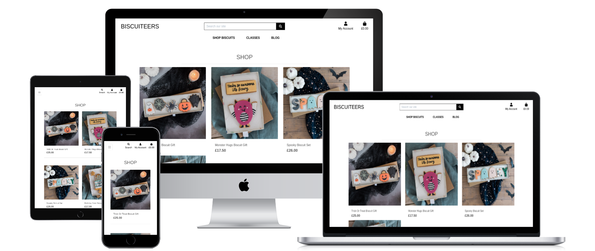

# User Experience (UX)
### User Stories

- #### Navigation

  - As a user, I want to navigate round the site easily to locate the products I want.
  - As a user, I want to view a list of all available products.
  - As a user, I want to be able to view more details on a product.
  - As a user, I want to be able to refine my search with categories.
  - As a user, I want to be able to see all ingredients contained within the product, including any allergens.

- #### Accounts

  - As a user, I want the option to register for an account, allowing me to save my details and see previous orders.
  - As a user, I want to receive confirmation emails to confirm my registration.
  - As a user, I want the ability to be able to log in and out, and be able to easily work out my current login status.
  - As a user, I want to be able to recover my account information in the event that I forget it.

- #### Admin

  - As an admin, I want to be able to add products easily.
  - As an admin, I want to be able to edit products easily to ensure the customer is being shown the most up to date information
  - As an admin, I want to be able to delete discontinued products.
  - As an admin, I want to be able to add and update the ingredients for products.

- #### Purchasing

  - As a user, I want to be able to add items to my cart, allowing me to store things until I'm ready to complete my purchase.
  - As a user, I want to be able to view my cart so I can see the current running total of my potential purchases.
  - As a user, I want the ability to update the quantity of the items in my cart easily.
  - As a user, I want an easily viewable total to allow me to monitor my overall spend.
  - As a user, I want to be able to complete the purchasing journey, without the need to register if I do not wish to.
  - As a user, I want to receive confirmation of my order so I know my order was placed successfully.
  - As a user, I want to be able to view my order history so I can review past purchases.

- #### Interaction

  - As a user, I want to be able to read store's blog posts.
  - As a user, I want to be able to comment onto blog posts.

## Design

  #### **Colour scheme**
  - Minimal palette consisting of shades of black, white and grey. Such palette was chosen to accompany colourful, bright product pictures.
  #### **Typography**
  - Roboto and Lexend fonts were used. These fonts are familiar to the user, professional and clean looking. 
  #### **Imagery**
  - Images were taken from [Unsplash](https://unsplash.com/photos/fGKWqJyAH4s), [Biscuiteers](https://www.biscuiteers.com/), [Honeywell bakes](https://honeywellbakes.com/)

## Wireframes
- Mobile Home page 
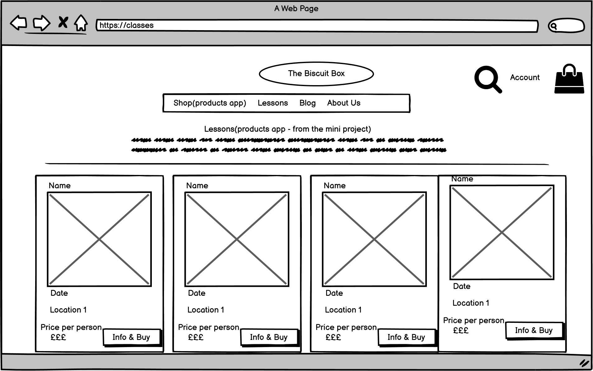
- Desktop Home page  
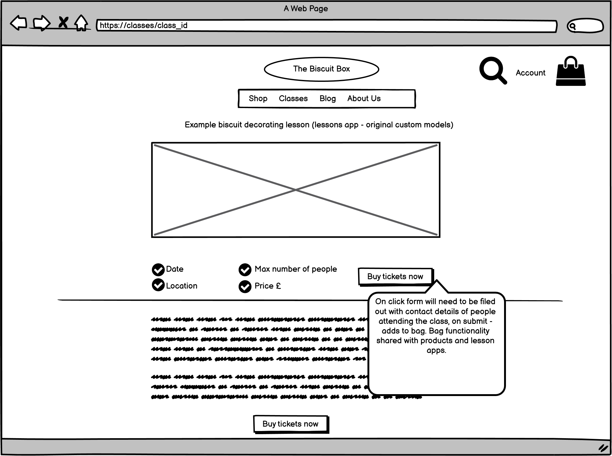

## Features

### CRUD functionality
Every aspect of CRUD functionality was tested by creating, updating, viewing and deleting products through admin.
# Further development
- For a further development a couple of features culd be implemented:
- Classes section woould have booking functionality, allowing users to book certain dates for certain amount of people.  
Calendar with availability and spaces left would be featured.
- Blog section would benefit from the ability to contain images.

# Technologies Used

# Testing

## Testing User Stories from User Experience (UX) Section
#### Navigation

  - As a user, I want to navigate round the site easily to locate the products I want.  
  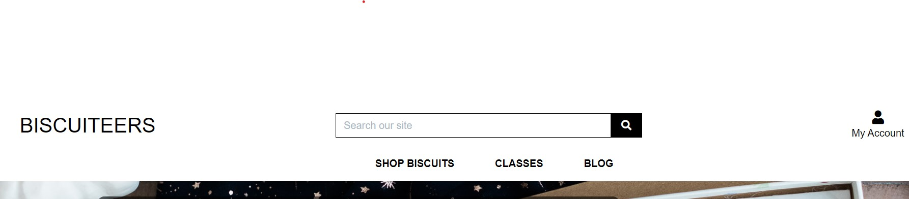
  - As a user, I want to view a list of all available products. 
  Upon clicking Shop button in the main nav, an option of All Products is displayed. 
  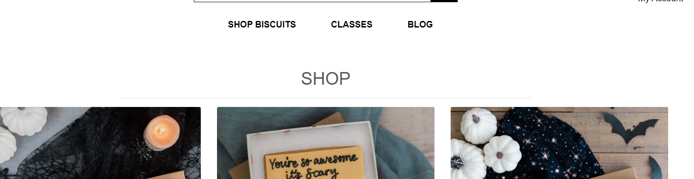
  - As a user, I want to be able to view more details on a product. 
  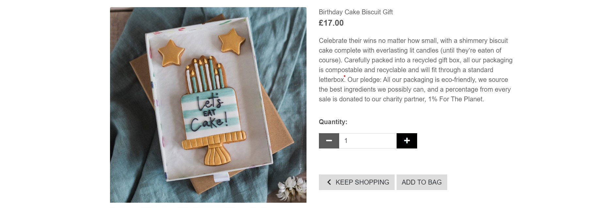
  - As a user, I want to be able to refine my search with categories. 
  Upon clicking Shop button in the main nav, all categories are displayed. 
  - As a user, I want to be able to see all ingredients contained within the product, including any allergens.  
  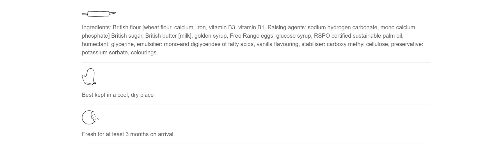

- #### Accounts

  - As a user, I want the option to register for an account, allowing me to save my details and see previous orders.  
    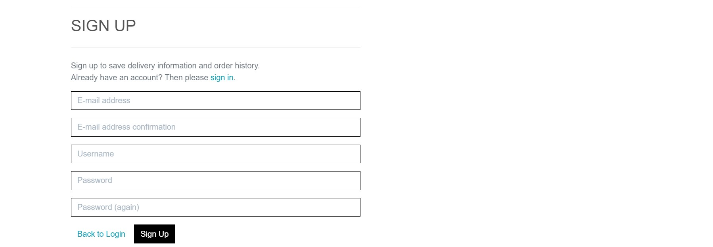
  - As a user, I want the ability to be able to log in and out, and be able to easily work out my current login status.
    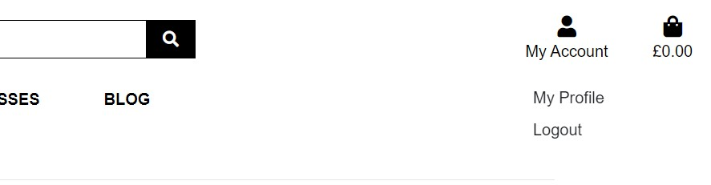
  - As a user, I want to be able to recover my account information in the event that I forget it.
    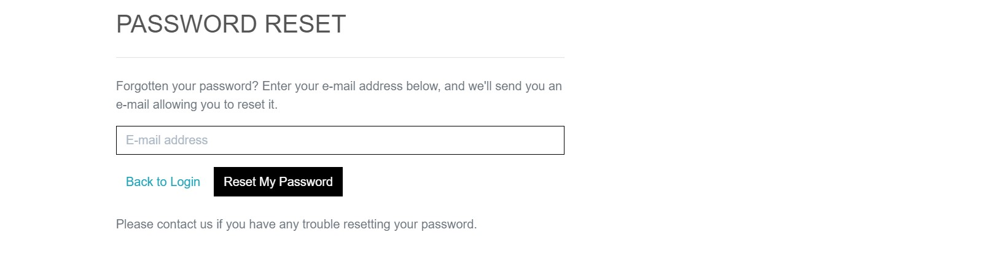

- #### Admin

  - As an admin, I want to be able to add products easily.
    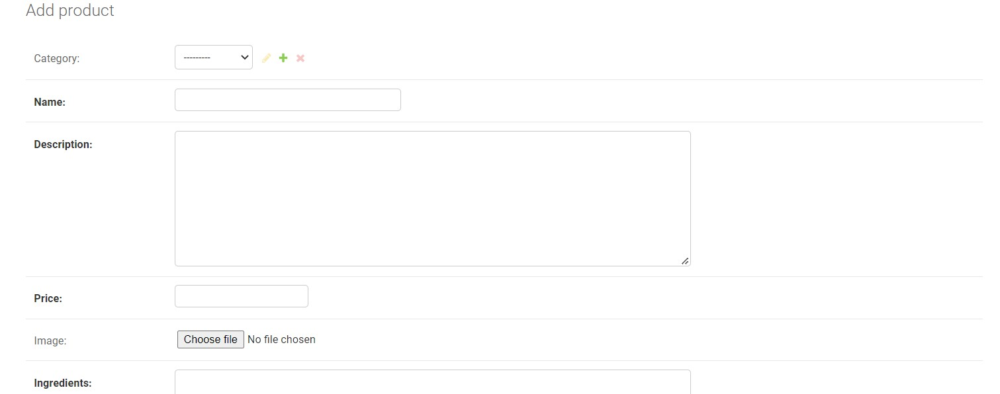
  - As an admin, I want to be able to edit products easily to ensure the customer is being shown the most up to date information
    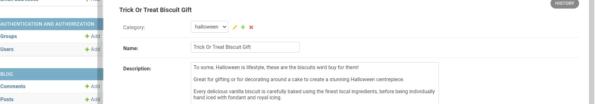
  - As an admin, I want to be able to delete discontinued products.
    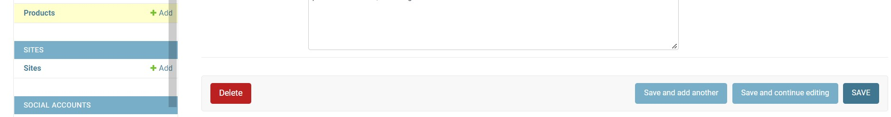
  - As an admin, I want to be able to add and update the ingredients for products.
    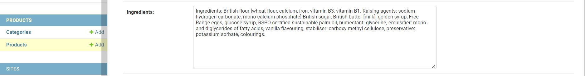

- #### Purchasing

  - As a user, I want to be able to add items to my cart, allowing me to store things until I'm ready to complete my purchase.
    
  - As a user, I want to be able to view my cart so I can see the current running total of my potential purchases.
    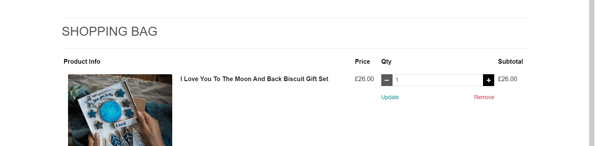
  - As a user, I want the ability to update the quantity of the items in my cart easily.
    
  - As a user, I want an easily viewable total to allow me to monitor my overall spend.
    
  - As a user, I want to be able to complete the purchasing journey, without the need to register if I do not wish to.
    Checkout functionality is equally simple for registered and unregistered users.
  - As a user, I want to receive confirmation of my order so I know my order was placed successfully.
    
  - As a user, I want to be able to view my order history so I can review past purchases.
    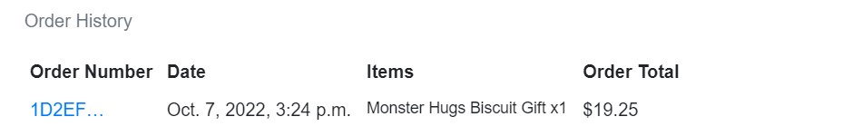

- #### Interaction

  - As a user, I want to be able to read store's blog posts.
    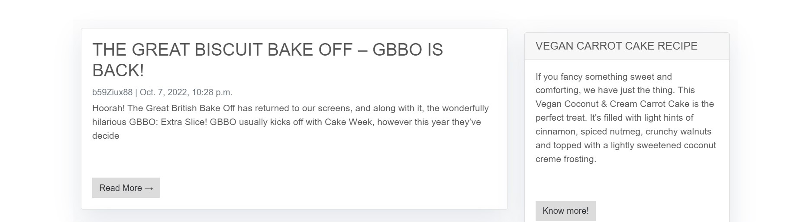
  - As a user, I want to be able to comment onto blog posts.
     
   - As a user, I want to be able to see that my comment was succesfull.
     

### The W3C Markup Validator and W3C CSS Validator Services were used to validate every page of the project to ensure there were no syntax errors in the project.
 * HTML validator results
 -Home  
 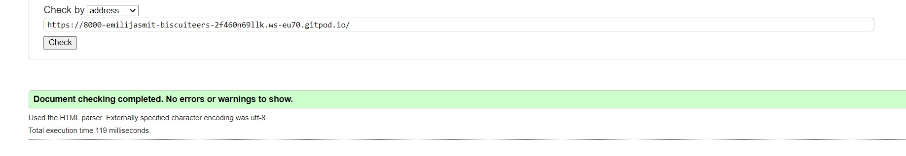
 -All products  
 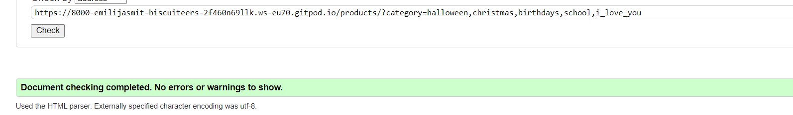
  -Product detail  
 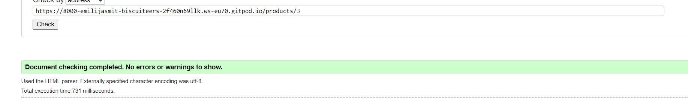
  -Bag  
 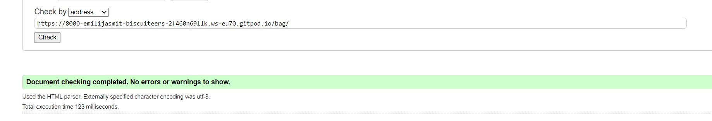
  -Checkout  
 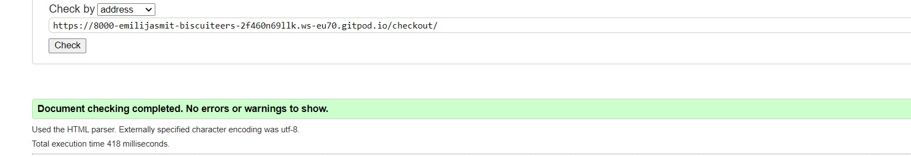
  -Checkout-success  
 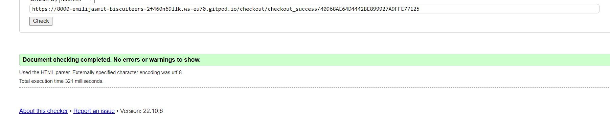
  -Blog  
 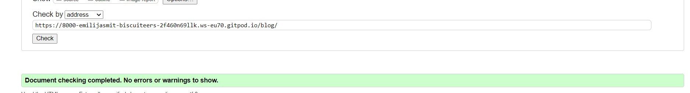
  -Blog-detail  
 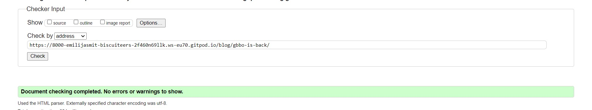
  -Classes  
 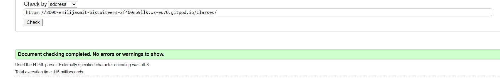
  -Login  
 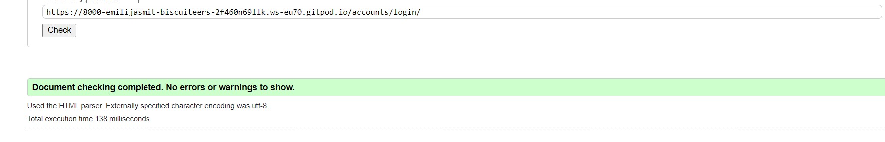
  -Register  
 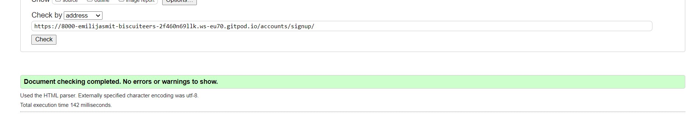
 
 * CSS validator results  
 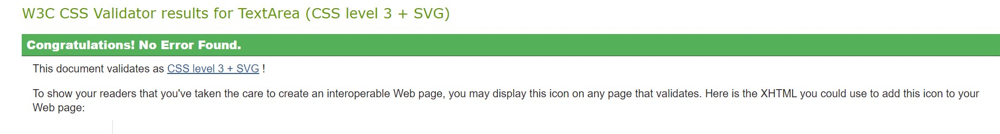  
 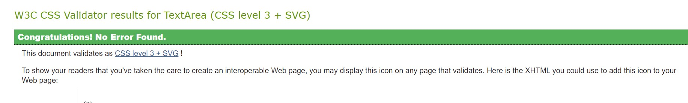

### PEP8 validator was used to check my code for PEP8 requirements
* PEP8 validator was added to my workspace using command `pip3 install pycodestyle`

### Chrome developer tools 
* Used to test responsiveness and functionality on various devices.

## Functionality testing
Thorough manual testing has been implemented, imitating every possible user interaction. None of it was able to break the code.
## Further Testing
* Website was given to friends and family to test on various devices. Good responsiveness and functionality were reported.

## Database Layout

## Bugs

# Deployment

## Heroku

## Forking the GitHub Repository
By forking the GitHub Repository we make a copy of the original repository on our GitHub account to view and/or make changes without affecting the original repository by using the following steps...
1. Log in to GitHub and locate the [GitHub Repository](https://github.com/emilija-smitaite/review-a-restaurant)
2. At the top of the Repository (not top of the page) just above the "Settings" button on the menu, locate the "Fork" button.
3. You should now have a copy of the original repository in your GitHub account.

## Making a Local Clone
1. Log in to GitHub and locate the [GitHub Repository](https://github.com/emilija-smitaite/biscuiteers-biscuit-shop)
2. Under the repository name, click "Clone or download".
3. To clone the repository using HTTPS, under "Clone with HTTPS", copy the link.
4. Open Git Bash
5. Change the current working directory to the location where you want the cloned directory to be made.
6. Type "git clone" and then paste the URL you copied in Step 3.
7. Press Enter. Your local clone will be created.

# Credits

## Code

* All content was written by the developer. Any code that was not written by the developer was referenced in a document.

## Acknowledgements

Thank you to my mentor Spencer Barribal for guidance.