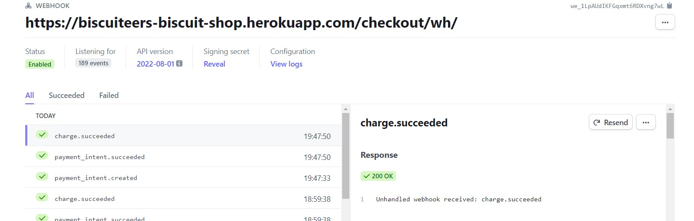

# The Biscuiteers Biscuit Shop
[View the live project here.](https://biscuiteers-biscuit-shop.herokuapp.com/)

Biscuiteers is an e-commerce site offering hand iced artisan biscuit gifts. <br>
Users also benefit from a blog with comment functionality. <br>
The site is fully responsive and was built using the Django framework in Python. <br>
The payment system is called Stripe, it is set up in a 'dummy' mode and will not accept real card details. <br>


# User Experience (UX)
### User Stories

- #### Navigation

  - As a user, I want to navigate round the site easily to locate the products I want.
  - As a user, I want to view a list of all available products.
  - As a user, I want to be able to view more details on a product.
  - As a user, I want to be able to refine my search with categories.
  - As a user, I want to be able to see all ingredients contained within the product, including any allergens.

- #### Accounts

  - As a user, I want the option to register for an account, allowing me to save my details and see previous orders.
  - As a user, I want the ability to be able to log in and out, and be able to easily work out my current login status.
  - As a user, I want to be able to recover my account information in the event that I forget it.

- #### Admin

  - As an admin, I want to be able to add products easily.
  - As an admin, I want to be able to edit products easily to ensure the customer is being shown the most up to date information
  - As an admin, I want to be able to delete discontinued products.
  - As an admin, I want to be able to add and update the ingredients for products.

- #### Purchasing

  - As a user, I want to be able to add items to my cart, allowing me to store things until I'm ready to complete my purchase.
  - As a user, I want to be able to view my cart so I can see the current running total of my potential purchases.
  - As a user, I want the ability to update the quantity of the items in my cart easily.
  - As a user, I want an easily viewable total to allow me to monitor my overall spend.
  - As a user, I want to be able to complete the purchasing journey, without the need to register if I do not wish to.
  - As a user, I want to receive confirmation of my order so I know my order was placed successfully.
  - As a user, I want to be able to view my order history so I can review past purchases.

- #### Interaction

  - As a user, I want to be able to read store's blog posts.
  - As a user, I want to be able to comment onto blog posts.
  - As a user, I want to be able to see that my comment was succesfull.


## Design

  #### **Colour scheme**
  - Minimal palette consisting of shades of black, white and grey. Such palette was chosen to accompany colourful, bright product pictures.
  #### **Typography**
  - Roboto and Lexend fonts were used. These fonts are familiar to the user, professional and clean looking. 
  #### **Imagery**
  - Images were taken from [Unsplash](https://unsplash.com/photos/fGKWqJyAH4s), [Biscuiteers](https://www.biscuiteers.com/), [Honeywell bakes](https://honeywellbakes.com/)

## Wireframes
- Mobile Home page<br>

- Desktop Home page <br>


## Features


### CRUD functionality
Every aspect of CRUD functionality was tested by creating, updating, viewing and deleting products through admin.
# Further development
- For a further development a couple of features culd be implemented:
- Classes section would have booking functionality, allowing users to book certain dates for certain amount of people. <br>
Calendar with availability and spaces left would be featured.
- Blog section would benefit from the ability to contain images.

# Technologies Used

# Testing

## Testing User Stories from User Experience (UX) Section
#### Navigation

  - As a user, I want to navigate round the site easily to locate the products I want. <br>
  
  - As a user, I want to view a list of all available products.<br>
  Upon clicking Shop button in the main nav, an option of All Products is displayed.<br>
  
  - As a user, I want to be able to view more details on a product.<br>
  
  - As a user, I want to be able to refine my search with categories.<br>
  Upon clicking Shop button in the main nav, all categories are displayed.<br>
  - As a user, I want to be able to see all ingredients contained within the product, including any allergens. <br>
  

- #### Accounts

  - As a user, I want the option to register for an account, allowing me to save my details and see previous orders. <br>
  <br> 
  - As a user, I want the ability to be able to log in and out, and be able to easily work out my current login status.
  <br> 
  - As a user, I want to be able to recover my account information in the event that I forget it.
  <br> 

- #### Admin

  - As an admin, I want to be able to add products easily.
  <br> 
  - As an admin, I want to be able to edit products easily to ensure the customer is being shown the most up to date information
  <br> 
  - As an admin, I want to be able to delete discontinued products.
  <br> 
  - As an admin, I want to be able to add and update the ingredients for products.
  <br> 

- #### Purchasing

  - As a user, I want to be able to add items to my cart, allowing me to store things until I'm ready to complete my purchase.
  <br> 
  - As a user, I want to be able to view my cart so I can see the current running total of my potential purchases.
  <br> 
  - As a user, I want the ability to update the quantity of the items in my cart easily.
  <br> 
  - As a user, I want an easily viewable total to allow me to monitor my overall spend.
  <br> 
  - As a user, I want to be able to complete the purchasing journey, without the need to register if I do not wish to.
  <br> Checkout functionality is equally simple for registered and unregistered users.
  - As a user, I want to receive confirmation of my order so I know my order was placed successfully.
  <br> 
  - As a user, I want to be able to view my order history so I can review past purchases.
  <br> 

- #### Interaction

  - As a user, I want to be able to read store's blog posts.
  <br> 
  - As a user, I want to be able to comment onto blog posts.
   <br> 
   - As a user, I want to be able to see that my comment was succesfull.
   <br> 

### The W3C Markup Validator and W3C CSS Validator Services were used to validate every page of the project to ensure there were no syntax errors in the project.
 * HTML validator results
 -Home <br>
 
 -All products <br>
 
  -Product detail <br>
 
  -Bag <br>
 
  -Checkout <br>
 
  -Checkout-success <br>
 
  -Blog <br>
 
  -Blog-detail <br>
 
  -Classes <br>
 
  -Login <br>
 
  -Register <br>
 
 
 * CSS validator results <br>
  <br>
 

### PEP8 validator was used to check my code for PEP8 requirements
* PEP8 validator was added to my workspace using command `pip3 install pycodestyle`
- There are linting errors remaining, nothing that affects the code.

### Chrome developer tools 
* Used to test responsiveness and functionality on various devices.

## Functionality testing
Thorough user , imitating every possible user interaction. None of it was able to break the code.
## Form validation
All the forms were created with help of  Django Forms.
Forms were testing by inputting data which would fail Django Forms validation.
## Stripe
- Stripe webhooks return status 200.

## Further Testing
* Website was given to friends and family to test on various devices. Good responsiveness and functionality were reported.

## Bugs
- On checkout app charfield was changed to CountryField with max_length of only 2. Previous orders had data which exceeded this limit therefore resulting in an error. Database had to be wiped out and reuploaded using fixtures.

# Deployment

### Heroku

In Heroku project can be built and deployed via a link to the Github Repo.

1. Once you are logged in to Heroku, click the 'New' button and select 'Create new app'.
2. Select a name for your app, select the closest region to you and click 'Create App'.
3. Once the app has been created, navigate to the 'Add-ons' section and search for 'Heroku Postgres'.
4. Select 'Heroku Postgres', choose 'Hobby Dev - Free' Plan Name and click 'Submit Order Form'.

To use Postgres with Django, additional tools are required, and can be installed via the CLI in your chose IDE.

1.  In your CLI type the command:  
    `pip3 install dj_database_url`
2.  Once completed, enter the following command into the CLI:  
    `pip3 install psycopg2-binary`
3.  At the top of the settings.py file in your main project folder, and the line:
    ```
    import dj_database_url
    ```
4.  Replace the code DATABASES section in settings with the code below.

    ```
    DATABASES = {
        'default': dj_database_url.parse(<DATABASE_URL_GOES_HERE>)
    }
    ```

    The Postgres Database URL can be found in the settings tab of your app in Heroku, under the Config Vars section.

5. Repeat migration.
    `python3 manage.py migrate`

6.  Create a new superuser:  
    `python3 manage.py createsuperuser`

7.  Before we commit these changes, change `DATABASES` section in settings.py to prevent the Postgres Database URL ending up in version control.

    ```
    if 'DATABASE_URL' in os.environ:
        DATABASES = {
            'default': dj_database_url.parse(os.environ.get('DATABASE_URL'))
        }
    else:
        DATABASES = {
            'default': {
                'ENGINE': 'django.db.backends.sqlite3',
                'NAME': BASE_DIR / 'db.sqlite3',
            }
    }
    ```

8.  Gunicorn needs to be installed next, which acts as our web server:

    `pip3 install gunicorn`

9. Kept in the root directory `Procfile` to tell Heroku to create a web dyno. Insert the code:

    `web: gunicorn PROJECT_NAME_HERE.wsgi:application`

10. Disable collection of static files until we have set up AWS. This is achieved by navigating to the Settings tab in Heroku, selecting the Config_Vars section and entering `DISABLE_COLLECTSTATIC` in the `KEY` field, and `1` in the `VALUE`.

    No static files present at deployed site at the moment.

11. Add the Project URL to the `ALLOWED_HOSTS` section of settings.py
    ```
    ALLOWED_HOSTS = ['PROJECT_NAME_HERE.herokuapp.com', 'localhost', '127.0.0.1']
    ```
12. Commit and then push to Heroku.

        `git push heroku main'


#### AWS used to store static and media files
-- Detailed setup in official docs: <br>
https://docs.aws.amazon.com/AmazonS3/latest/userguide/HostingWebsiteOnS3Setup.html

#### Connecting AWS to Django

Now that AWS has been configured, connect Django to AWS.

1. Firstly, install two packages. `Boto3` and `django-storages`:
   ```
   pip3 install boto3
   pip3 install django-storages
   ```
2. Add `storages` to the `INSTALLED_APPS` section of settings.py.
3. At the bottom of settings.py add the following code:
   ```
   if 'USE_AWS' in os.environ:
       AWS_STORAGE_BUCKET_NAME = 'your-bucket-name-here'
       AWS_S3_REGION_NAME = 'insert-your-region-here'
       AWS_ACCESS_KEY_ID = os.environ.get('AWS_ACCESS_KEY_ID')
       AWS_SECRET_ACCESS_KEY = os.environ.get('AWS_SECRET_ACCESS_KEY')
   ```
4. In Heroku, in the `Settings` tab, under `Config Vars`, we need to add the values from the CSV file we downloaded earlier.
5. Add the key `AWS_ACCESS_KEY_ID` with the value that was generated in the CSV file. Add the key `AWS_SECRET_ACCESS_KEY`, and add the value that was generated in the CSV file. Add the key `USE_AWS` and set the value to True.
6. Remove DISABLE_COLLECTSTAIC variable.
7. Return to the settings.py file and add the following code to the `USE_AWS` if statement created earlier:
   ```
   AWS_S3_CUSTOM_DOMAIN = f'{AWS_STORAGE_BUCKET_NAME}.s3.amazonaws.com'
   ```
8. In the root directory of your project, create a file called `custom_storages.py`. Inside this file add the following code:
   ```
   from django.conf import settings
   from storages.backends.s3boto3 import S3Boto3Storage
   ```
9. Underneath the imports insert these two classes:

    ```
    class StaticStorage(S3Boto3Storage):
        location = settings.STATICFILES_LOCATION


    class MediaStorage(S3Boto3Storage):
        location = settings.MEDIAFILES_LOCATION
    ```

10. In settings.py, underneath the bucket config settings but still inside the if statement, add these lines:
    ```
    STATICFILES_STORAGE = 'custom_storages.StaticStorage'
    STATICFILES_LOCATION = 'static'
    DEFAULT_FILE_STORAGE = 'custom_storages.MediaStorage'
    MEDIAFILES_LOCATION = 'media'
    ```
11. Next, add these two lines inside the same if statement:
    ```
    STATIC_URL = f'https://{AWS_S3_CUSTOM_DOMAIN}/{STATICFILES_LOCATION}/'
    MEDIA_URL = f'https://{AWS_S3_CUSTOM_DOMAIN}/{MEDIAFILES_LOCATION}/'
    ```
12. We can now save, add, commit and push the changes and files will b e added to the AWS S3 bucket. Inside the if statement add the code below which lets the browser know it can cache static files:
    `AWS_S3_OBJECT_PARAMETERS = { 'Expires': 'Thu, 31 Dec 2099 20:00:00 GMT', 'CacheControl': 'max-age=94608000', }`
    14.In `S3` on `AWS`, go to your project bucket and click `Create folder`. Name the folder `media` and click `Save`.

13. Inside the media folder, click `Upload`, `Add files`, and then select all media files used in your project.
14. Under `Permissions`, select `Grant public-read access` and click `Upload`. You will need to acknowledge the displayed warning before you can do this.

## Forking the GitHub Repository
By forking the GitHub Repository we make a copy of the original repository on our GitHub account to view and/or make changes without affecting the original repository by using the following steps...
1. Log in to GitHub and locate the [GitHub Repository](https://github.com/emilija-smitaite/review-a-restaurant)
2. At the top of the Repository (not top of the page) just above the "Settings" button on the menu, locate the "Fork" button.
3. You should now have a copy of the original repository in your GitHub account.

## Making a Local Clone
1. Log in to GitHub and locate the [GitHub Repository](https://github.com/emilija-smitaite/biscuiteers-biscuit-shop)
2. Under the repository name, click "Clone or download".
3. To clone the repository using HTTPS, under "Clone with HTTPS", copy the link.
4. Open Git Bash
5. Change the current working directory to the location where you want the cloned directory to be made.
6. Type "git clone" and then paste the URL you copied in Step 3.
7. Press Enter. Your local clone will be created.

# Credits

## Code
* All content was written by the developer. Any code that was not written by the developer was referenced in a document.
## Acknowledgements
Thank you to my mentor Spencer Barriball for guidance.